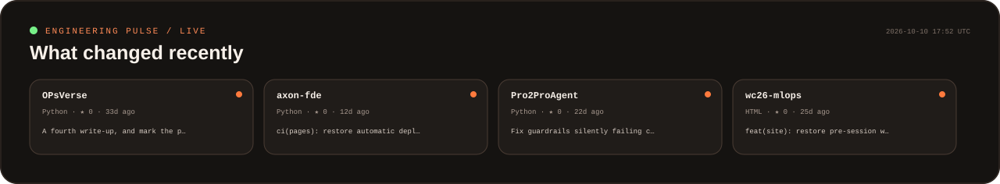

<div align="center">



<br/>

### Dilip Nallamasa
**AI Engineer · LLM Systems · Applied ML**

I work across the part of AI that starts **after the demo**: model adaptation, retrieval, agents, evaluation, serving, observability, and failure analysis.

[Portfolio](https://dilip-portfolio-one.vercel.app/) · [LinkedIn](https://www.linkedin.com/in/dilip-n-ab1091417/) · [Email](mailto:dilip.nallamasa@gmail.com)

</div>

---



### `proof > adjectives`

| System | Engineering problem | Evidence |
|---|---|---|
| **[OpsVerse](https://github.com/dilipna/OPsVerse)** · [demo](https://ops-verse.vercel.app/) | Post-train Qwen3-4B, retrieve with BGE + BM25 + RRF, rerank, ground citations, gate releases with evals, serve with vLLM | **MRR@10 0.705** · **1,914** graded judgments · **245** regression tests · **~6×** lower cost/response |
| **[AxonFDE](https://github.com/dilipna/axon-fde)** · [demo](https://dilipna.github.io/axon-fde/#top) | Fuse telemetry, orders, and shipping docs; predict breaches; reconcile conflicts; require human approval; audit every action | **49 min** median lead time · **23/23** planted conflicts · **0** unauthorized actions / 50 tests · **4.92 s** decision cycle |
| **[Pro2Pro](https://github.com/dilipna/Pro2ProAgent)** · [demo](https://protopro.vercel.app/) | Checkpointed LangGraph + MCP orchestration with resumable state, human approval, guardrails, tracing, and model fallback | **78** evaluation tests |
| **[FIFA2026MLOps](https://github.com/dilipna/wc26-mlops)** · [demo](https://fifa2026mlops.vercel.app/) | Elo + gradient boosting + Monte Carlo forecasting with automated training, validation, deployment, lineage, and drift monitoring | **Airflow · MLflow · Evidently · OpenTelemetry** |

### `research / active`

<table>
<tr>
<td width="50%" valign="top">

#### ♟ ChessAssistLens
Research with **Prof. Kenneth W. Regan**

Compare a **Regan-inspired statistical reconstruction**, **Qwen3-8B**, and **Maia-3** on the same chess decisions using Stockfish MultiPV and controlled engine-assisted substitutions.

**Measured result**

`+0.047 AUC` Maia-derived signal gain  
`95% CI +0.040 → +0.054`  
`2,000` paired source-game bootstrap resamples

[Open research demo →](https://chessassistlens.vercel.app/)

</td>
<td width="50%" valign="top">

#### 🛡 Physical AI Security
Research with **Prof. Haipeng Cai**

Systematizing failure modes of LLM/VLM-driven physical agents across prompt/tool attacks, adversarial perception, leakage, and unsafe actions.

**Current direction**

LLM-assisted vulnerability localization → patch proposal → sandbox regression test.

</td>
</tr>
</table>

### `engineering surface`

```text
MODELS        PyTorch · Transformers · Qwen · TRL · PEFT · QLoRA · SFT · DPO
RETRIEVAL     RAG · BGE · BM25 · RRF · reranking · Qdrant
AGENTS        LangGraph · LangChain · MCP · tool use · human-in-the-loop
EVALUATION    benchmarks · regression tests · paired bootstrap · guardrails · red teaming
SERVING       FastAPI · vLLM · REST APIs · Docker · Kubernetes · AWS
OBSERVABILITY Langfuse · OpenTelemetry · MLflow · Evidently · CI/CD
```

### `published`

- **[GWO-Based Fed-UNet-CNN Model for Leukocytes Classification Across Developmental Stages](https://doi.org/10.21203/rs.3.rs-9183195/v1)**
- **[The Future of Smart Factories: Real-Time Automation and Big Data Analytics](https://ieeexplore.ieee.org/document/10726023)**

---

## Building, one commit at a time.

<p align="center">
  <picture>
    <source
      media="(prefers-color-scheme: dark)"
      srcset="https://raw.githubusercontent.com/dilipna/dilipna/output/github-contribution-grid-snake-dark.svg"
    />
    <source
      media="(prefers-color-scheme: light)"
      srcset="https://raw.githubusercontent.com/dilipna/dilipna/output/github-contribution-grid-snake.svg"
    />
    
  </picture>
</p>

<div align="center">

### Building AI that has to work after the demo.

**AI Engineer @ Globant** · **M.S. AI @ University at Buffalo · Dec 2026**

<sub>The activity panel above is generated from GitHub data by a scheduled GitHub Action in this profile repository.</sub>

</div>
